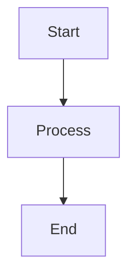

# :postbox: devto-cli

[](LICENSE)

> [Dev.to](https://dev.to) authoring CLI to create and publish markdown files as articles, using assets hosted on GitHub.

_This is an opinionated fork of [devto-cli](https://github.com/sinedied/devto-cli) by [@sinedied](https://github.com/sinedied). The original CLI provides article creation, push to dev.to, stats display, GitHub repository bootstrapping, and a [GitHub Action](https://github.com/sinedied/publish-devto) for automated publishing — all without config files._

This fork adds:
- Proxy support for corporate environments (HTTP/HTTPS_PROXY)
- Automatic diagram generation using [Kroki](https://kroki.io)
- Organization publishing support
- Table of contents generation
- Broken link checking
- Automatic footer management
- Article file renaming based on title
- Article badges generation
- ANSI color blocks for styled terminal-like output in articles

## Installation

```bash
git clone https://github.com/bcouetil/devto-cli.git
cd devto-cli
npm install
npm run build
npm link
```

This makes the `dev` command available globally.

## Usage

Create a `.env` file in your articles directory:

```bash
DEVTO_TOKEN=your_dev_to_api_token
DEVTO_ASSETS_PUBLIC_REPO=username/articles
DEVTO_ASSETS_PUBLIC_BRANCH=main
DEVTO_ORG=your-organization
DEVTO_FOOTER_FILE=path/to/further-readings.md

# Override ANSI block colors (optional)
# ANSI_RED=#e74c3c
# ANSI_BG_BLUE=#2980b9
```

Then run commands from that directory:

```
Usage: dev <init|new|push|stats|diaggen|toc|checklinks|rename|badges> [options]

Commands:
  i, init               Init current dir as an article repository
    -p, --pull          Pull your articles from dev.to
    -s, --skip-git      Skip git repository init
  n, new <file>         Create new article
  r, rename <files>     Rename article files based on their title
    -d, --dry-run       Show what would be renamed without doing it
  d, diaggen [files]    Generate diagram images from code blocks [default: posts/**/*.md]
  t, toc [files]        Update table of contents in articles [default: *.md]
  c, checklinks [files] Check for broken links in articles [default: *.md]
  p, push [files]       Push articles to dev.to [default: posts/**/*.md]
    -d, --dry-run       Do not make actual changes on dev.to
    -e, --reconcile     Reconcile articles without id using their title
    -u, --update-toc    Update table of contents before pushing
  s, stats              Display stats for your latest published articles
    -n, --number <n>    Number of articles to list stats for [default: 10]
    -j, --json          Format result as JSON
  badges [files]        Generate _ARTICLES.md with article badges [default: *.md]
    -o, --output <file> Output file [default: _ARTICLES.md]
    --jpg               Generate JPEG badges in images/badges/

General options:
  -t, --token <token>   Use this dev.to API token
  -r, --repo <repo>     GitHub repository (in "user/repo" form)
  -b, --branch <branch> GitHub branch [default: master]
  -v, --version         Show version
  --verbose             Show detailed logs
  --help                Show this help
```

### Init

`dev init` initializes the current folder as a repository for all your articles.

It does 3 things:

1. Setup a [GitHub Actions workflow](https://github.com/sinedied/publish-devto) to automatically push your updates to dev.to each time a new commit is added to the `main` branch

2. Create a `posts` folder with a first article

3. Make the current folder a git repository, unless the `--skip-git` option is used. [Git](https://git-scm.com) must be installed otherwise this step will be skipped.

There are a few more step needed to finish the setup on GitHub, see the [quickstart tutorial](#create-a-new-github-repository-synchronized-with-dev.to) for details.

### New

`dev new <file>` creates a new markdown file with front matter properties prepared for you.

### Rename

`dev rename <files>` renames article files based on their title, using a consistent naming strategy.

**Algorithm:**
1. Remove leading emoji and colon separator from the title
2. Filter out stop words, numbers, and category words (matching the filename prefix)
3. Keep the first 5 significant words
4. Convert to kebab-case

The filename prefix (everything before the last `_`) is preserved. For example, a file named `23_05_01_GITLAB_old-name.md` with title "🦊 GitLab CI: Best Practices for Pipelines" would become `23_05_01_GITLAB_ci-best-practices-pipelines.md`.

**Example:**
```bash
dev rename "*.md"           # Rename all markdown files
dev rename --dry-run "*.md" # Preview changes without renaming
```

### Diaggen

`dev diaggen [files]` generates PNG images from diagram code blocks using Kroki (default: `*.md`).

See [Diagrams support](#diagrams-support) for complete workflow and supported diagram types.

### Toc

`dev toc [files]` updates the table of contents in markdown files (`*.md` by default).

This command uses the [bitdowntoc](https://github.com/derlin/bitdowntoc) algorithm adapted for dev.to anchor generation.

**Usage:**

Add TOC markers in your markdown file:

```markdown
<!-- TOC start -->

<!-- TOC end -->
```

Then run `dev toc` to generate/update the table of contents between these markers.

You can also use `dev push --update-toc` to automatically update TOC before pushing to dev.to.

### Checklinks

`dev checklinks [files]` checks for broken links in markdown files (`*.md` by default).

This command scans all markdown links `[text](url)` and verifies they are accessible.

**Features:**
- Only checks markdown-formatted links (ignores URLs in code blocks)
- Treats bot-blocking responses (403, 429, 503) as valid
- Reports truly broken links (404, 410) and connection errors
- Shows a summary with file and link statistics

**Example output:**
```
✓ my-article.md (15 links OK)
⚠ another-article.md (1/8 broken)
    ✗ https://example.com/deleted-page (HTTP 404)

Files: 10 OK | 1 with broken links | 2 skipped
Links: 95 OK | 1 broken
```

### Badges

`dev badges [files]` generates a `_ARTICLES.md` file with visual article badges organized by category (`*.md` by default).

Each badge displays the article's cover image on the left with the title, publication date, and stats (reactions, reading time) on the right, fetched from the dev.to API.

**Features:**
- Articles grouped by category (extracted from filename prefix: GITLAB, K8S, GIT, MISC)
- 2-column grid layout using HTML tables (GitHub-compatible)
- Cover images served from GitHub raw URLs (no extra files to commit)
- Sorted by publication date (newest first) within each category
- Only published articles with a date are included

**Usage:**
```bash
dev badges "*.md"                          # Generate _ARTICLES.md (HTML mode)
dev badges "*.md" --jpg                    # Generate JPEG badges + _ARTICLES.md
dev badges "*.md" --output README.md       # Custom output file
```

**JPEG mode (`--jpg`):**

Generates individual JPEG badge files in `images/badges/` with the article cover as full background, title in white overlay, and stats (date, reactions, reading time). The `_ARTICLES.md` uses a 2-column grid of these JPEG badges.

### Push

`dev push [files]` pushes all updates for the specified files to dev.to (`*.md` by default, globs supported).

This command only updates articles that have changes.

If an article have an `id` property defined in front matter it will be updated, otherwise a new article will be created and the local file will be updated with the `id`. You can also [reconcile articles](#reconcile-with-existing-articles) without an `id` property using their title if needed.

When an article is pushed with `published: true`, a new property `date` will be added to the local file to recird the article's publication date.

### Images hosting

You can add image files in your repository along your markdown and link to them directly. 

When an article is pushed to dev.to, all **relative** images links (without an `http(s)://` prefix) will be modified with the format `https://raw.githubusercontent.com/<USER>/<REPO_NAME>/<BRANCH>/` prefix to leverage GitHub hosting. You have make sure that you pushed your git changes including the images to your GitHub repository, otherwise you might end up with `404` errors. By default the CLI will [check]((#check-for-offline-images)) that all your linked images are online before pushing to avoid mistakes.

All absolute image links will be left untouched, so you can choose to host your images elsewhere if you prefer.

#### Diagrams support

The CLI automatically converts diagram code blocks into images using [Kroki](https://kroki.io).

**Supported types:** mermaid, plantuml, graphviz, ditaa, blockdiag, svgbob

**Workflow:**

1. Add a diagram with an optional name comment:

````markdown
<!-- diagram-name: my-flowchart -->

````

2. Generate images, commit to GitHub, then push to dev.to:

```bash
dev diaggen
git add posts/images/ && git commit -m "feat: add diagrams" && git push
dev push
```

**Notes:**
- Images are cached by content checksum - rerun `dev diaggen` after modifications
- Original markdown files remain unchanged

#### Reconcile with existing articles

If you have markdown files for articles that are already on dev.to but do not have an `id` front matter property, you can use `--reconcile` option to match articles using their title, to avoid duplicates.

Matched local files will then be updated with the corresponding `id` property.

You can use [dry run](#dry-run) mode to ensure that your articles properly match without making any changes.

#### Check for offline images

By default thee CLI will check all images URLs of an article to be online before pushing the changes to dev.to.

If an image is offline, the article will be marked as failed and won't be pushed to dev.to. You can use the `--verbose` option to see which image was found offline.

This is particularly useful as dev.to cache images for quite a long time, including URLs resulting in 404 errors. This means that even if you fix your image after seeing it broken, dev.to will still show a broken image until the cache is expired.

You can disable this behavior using the `--skip-check-images` option, but it's really not recommended to do so.

#### Dry run

Using the `--dry-run` option the whole push process will be executed, but without making any changes on dev.to or local files. You can use this to check your configuration and see what changes you can expect.

#### ANSI color blocks

The CLI supports colored code blocks using a custom `ansi` syntax. During push, ` ```ansi ` blocks are converted to styled HTML `<pre><code>` blocks in memory — your local files remain unchanged.

**Syntax:**

Use `{{TAG}}` to start a color and `{{/}}` to end it. The closing tag is optional — if omitted, the style applies until the next tag or end of block.

````markdown
```ansi
{{GREEN}}Success:{{/}} operation completed
{{BOLD_RED}}Error:{{/}} something went wrong
{{BG_BLUE}}Highlighted section{{/}}
```
````

**Available tags:**

Each base color (RED, GREEN, YELLOW, ORANGE, BLUE, MAGENTA, CYAN, WHITE, GRAY) supports three variants:

| Variant    | Example        | CSS effect                           |
| ---------- | -------------- | ------------------------------------ |
| Text       | `{{RED}}`      | `color`                              |
| Bold       | `{{BOLD_RED}}` | `color` + `font-weight:bold`         |
| Background | `{{BG_RED}}`   | `background-color` + bold white text |

> **Note:** All background variants use bold white text, except `BG_WHITE` which uses dark text for readability.

**Default color palette** (green and cyan match GitLab job logs colors)**:**

| Color   | Hex       |
| ------- | --------- |
| RED     | `#ff6161` |
| GREEN   | `#5cf759` |
| YELLOW  | `#f4d03f` |
| ORANGE  | `#ffaf00` |
| BLUE    | `#5797ff` |
| MAGENTA | `#8e44ad` |
| CYAN    | `#00bdbd` |
| WHITE   | `#ecf0f1` |
| GRAY    | `#bcbcbc` |

**Custom colors:**

You can override any color using environment variables with the `ANSI_` prefix:

```bash
ANSI_RED=#cc0000 ANSI_GREEN=#00cc00 dev push
```

Or add them to your `.env` file:

```
ANSI_RED=#cc0000
ANSI_CUSTOM=#ff00ff
```

You can also define entirely new color names (e.g., `ANSI_CUSTOM=#ff00ff` creates `{{CUSTOM}}`, `{{BOLD_CUSTOM}}`, and `{{BG_CUSTOM}}`).

**Soft-wrapping:**

Lines inside ANSI blocks are automatically soft-wrapped at 75 characters to fit dev.to code block width.

### Stats

`dev stats` allows you to see the stats for your latest *published* articles.

Only the latest 10 are shown by default, but you can change that number using the `--number` option.

You can also choose to get the resultats formatted as JSON using the `--json` options.

### Configure dev.to token and GitHub repository URL and branch

Most commands require a [dev.to API key](https://docs.dev.to/api/#section/Authentication/api_key) and a GitHub repository url and branch to work properly.

#### Dev.to token

First, if you don't have a dev.to API key you have to generate one following [this procedure](https://developers.forem.com/api/#section/Authentication/api_key).

You can either use the `--token` to provide the token to CLI commands, or set the `DEVTO_TOKEN` environment variable.

As an alternative, you can also create a `.env` file at the root of your articles repository and add `DEVTO_TOKEN=<YOUR_TOKEN>` in it. BE SURE TO AVOID COMMITTING THAT FILE TO GITHUB, otherwise your token will be exposed.

#### GitHub repository URL and branch

In order to [host your images using GitHub](#images-hosting) the tool needs to know your GitHub repository URL and branch.

If your git repository is initialized and you have the `origin` remote set to your GitHub repository it will be auto-detected and you have nothing to do.

Otherwise, you can either use the `--repo` option to provide your GitHub repository in the form `<USER>/<REPO_NAME>`, or set the `DEVTO_ASSETS_PUBLIC_REPO` environment variable.

You can also create a `.env` file at the root of your repository and add `DEVTO_ASSETS_PUBLIC_REPO=<USER>/<REPO_NAME>` in it.

By default, the tool will try to detect the branch from which it was run and use it. If you want to use a different branch, you can use the `--branch` option to specify it, or set the `DEVTO_ASSETS_PUBLIC_BRANCH` environment variable.

You can also add `DEVTO_ASSETS_PUBLIC_BRANCH=<BRANCH>` in a `.env` file at the root of your repository.

#### Publishing under an organization

To publish articles under a dev.to organization instead of your personal account:

1. Add `DEVTO_ORG=<organization-username>` to your `.env` file

2. Add `organization: <organization-username>` to your article's front matter, or let the CLI add it automatically

When you run `dev push`, the CLI will:
- Automatically add the organization field to articles that don't have it
- Resolve the organization ID from the organization username via the dev.to API
- Publish articles to the specified organization

**Publishing under your personal account:**

- If `DEVTO_ORG` is **not** defined: articles without the `organization` field will publish under your personal account (default behavior)
- If `DEVTO_ORG` **is** defined: add `organization: <none>` to explicitly publish under your personal account instead of the organization. This value will never be replaced by the CLI.

#### Automatic footer for articles

You can configure an automatic footer that will be appended to all **published** articles during push. This is useful for adding consistent "Further Readings" sections, author bios, or other recurring content.

**Setup:**

Add `DEVTO_FOOTER_FILE=<path-to-footer-file>` to your `.env` file. The path can be:
- Absolute path: `/home/user/articles/.github/further-readings.md`
- Relative to current working directory: `.github/further-readings.md`
- Relative to the article file location

**How it works:**

1. The CLI reads the footer file and identifies its first non-empty line as the "marker"
2. When pushing an article with `published: true`, it searches for this marker in the article content
3. If found, everything from the marker to the end of the article is replaced with the footer content
4. If the marker is not found, the article remains unchanged

**Example:**

Footer file (`further-readings.md`):
```markdown
# Further Readings

- [Article 1](https://example.com/article1)
- [Article 2](https://example.com/article2)
```

In your article, add the same first line where you want the footer:
```markdown
# My Article Content

Some content here...

# Further Readings

- [Old link](https://example.com/old)
```

When pushing, the "# Further Readings" section and everything after will be replaced with the current footer file content.

**Notes:**
- Footer is only applied to articles with `published: true`
- The marker matching is based on trimmed content (leading/trailing whitespace is ignored)
- The local article file is also updated with the new footer

### Working behind a proxy

If you're working in a corporate environment behind a proxy, the CLI supports proxy configuration through standard environment variables:

- `HTTP_PROXY` or `http_proxy` - HTTP proxy URL
- `HTTPS_PROXY` or `https_proxy` - HTTPS proxy URL

Example:
```bash
export HTTPS_PROXY=http://proxy.company.com:8080
dev push
```

The proxy configuration will be used for:
- API calls to dev.to
- Diagram generation using Kroki
- Image availability checks

If you experience issues with self-signed certificates in your corporate proxy, the CLI is configured to accept them for diagram generation.

## Using frontmatter properties

Any markdown file matching the specified input pattern and containing at least a `title` frontmatter property will be considered as an article and synchronized with dev.to.

All frontmatter properties [natively supported by dev.to](https://dev.to/p/editor_guide#front-matter) can be used here.

In addition, these frontmatter properties specified to the CLI are used to configure the behavior of the tool:
- `id`: The article ID on dev.to. If not specified, a new article will be created on publish.
- `date`: The publication date of the article. If not specified, the current date will be used on publish.
- `link`: The URL of the article on dev.to. Automatically updated after each push.
- `organization`: The organization username to publish under. If not specified and `DEVTO_ORG` is set, it will be added automatically.
- `devto_sync`: If set to `false`, the article will not be synchronized with dev.to at all.
